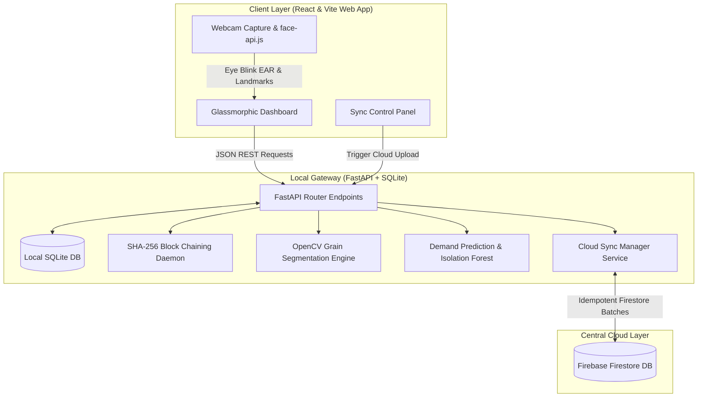
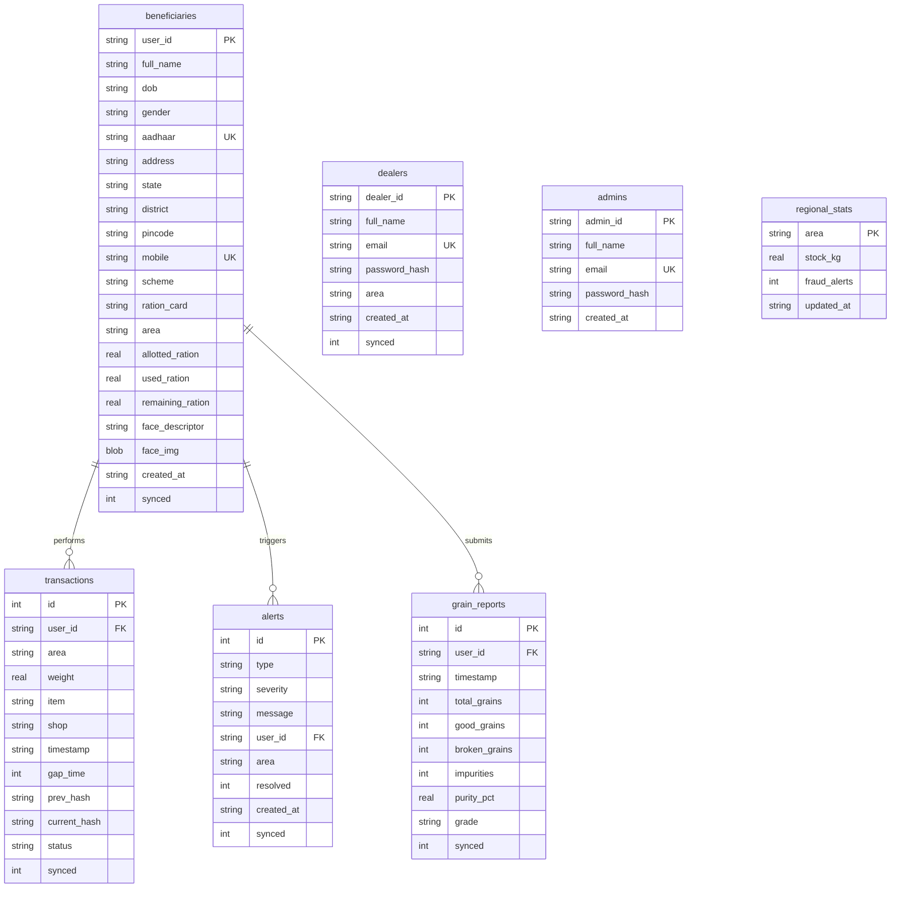

# RationLink — Smart Public Distribution System (PDS)
> **An AI, Computer Vision, and Blockchain-powered offline-first Rationing System designed for transparency, security, and cloud-resilient accountability.**

RationLink is a modern academic prototype that redefines traditional rationing distribution. Built to solve critical PDS leaks, ghost beneficiary collections, database tampering, and grain quality manipulation, RationLink combines **local hardware-accelerated computer vision, machine learning anomaly detection, cryptographic SHA-256 ledger chaining**, and an **offline-first hybrid sync architecture**.

---

## 1. Core Technical Highlights
* 🛡️ **Cryptographic Ledger Integrity (Blockchain)**: Transactions are chained sequentially using SHA-256 block hashing (`prev_hash` + `current_hash`). A dedicated integrity daemon audits the ledger in real-time, instantly raising alerts if database records are directly altered.
* 👁️ **Eye-Blink Liveness Biometrics**: Integrated `face-api.js` local facial landmark tracking in the browser. Calculates the **Eye Aspect Ratio (EAR)** in a dynamic animation frame loop to prevent static photo spoofing. Bio-capture only unlocks once a physical blink pattern is verified.
* 🌾 **Computer Vision Grain Quality Audit**: OpenCV-powered backend analyze engine executing Gaussian blur, Otsu's adaptive thresholding, contour extraction, and HSV space color thresholding. Quantifies **Full Grains**, **Broken Grains**, and **Foreign Impurities** (debris/stones) instantly.
* 🧠 **AI Anomaly & Demand Prediction**:
  * **Fraud Detection**: Scans transactions using scikit-learn's `IsolationForest` to flag high-velocity operations, unusual collection gaps, or statistical outliers.
  * **Demand Forecasting**: Runs `LinearRegression` on local transactional history to forecast future area grain requirements with auto-generated synthetic fallbacks.
* 🔄 **Offline-First Cloud Sync Manager**: Tracks local SQLite mutations using standard synchronization status flags. Automatically batches and syncs local datasets into central **Firebase Firestore** collections (`beneficiaries`, `dealers`, `transactions`, `alerts`, `grain_reports`) using natural idempotent keys.
* 💻 **Glassmorphic UI/UX Dashboard**: Professional dashboard styled with vanilla CSS and Tailwind variables, integrated with **Recharts** area and bar graph visualizers.

---

## 2. System Architecture Diagram



---

## 3. Database Schema Specification



---

## 4. Key Project Workflows

### A. Beneficiary Enrollment & Liveness Check
1. The operator inputs beneficiary demographic details (validated by strict Aadhaar Verhoeff checksum and mobile regex rules).
2. The user faces the webcam. `face-api.js` loads TinyFaceDetector models locally on the CPU.
3. The client captures frames and measures the distance ratios between vertical and horizontal eye coordinate landmarks (Eye Aspect Ratio).
4. When the user blinks, the EAR index drops below `0.22` and rises back above `0.26`.
5. Upon verification, the "Capture Biometric descriptor" button unlocks, extracts the 128-dimensional vector, and saves the user record in SQLite.

### B. Transaction Ledger Security (Chaining & Audit)
1. When a transaction is submitted, the API queries the previous block's SHA-256 hash.
2. Generates a new unique hash incorporating block parameters:
   $$\text{Current Hash} = \text{SHA256}(\text{user\_id} + \text{weight} + \text{prev\_hash} + \text{area} + \text{item} + \text{timestamp})$$
3. If an adversary edits a transaction's `weight` directly in the database (bypassing the application logic), the chain breaks.
4. The administrative integrity dashboard detects the mismatch:
   $$\text{Stored Current Hash} \neq \text{SHA256}(\text{Record Parameters} + \text{prev\_hash})$$
5. Instantly marks the ledger as **TAMPERED**, flags the exact block index, and generates a critical threat alert.

### C. Cloud Sync Pipeline
1. The client Topbar runs a connection-status ping.
2. If online, the cloud sync manager finds all SQLite rows where `synced = 0`.
3. Compiles records from `beneficiaries`, `dealers`, `transactions`, `alerts`, and `grain_reports`.
4. Uploads them in batches using natural idempotent keys (e.g., telephone numbers or transaction identifiers) to Firestore to prevent duplication.
5. Marks local rows as `synced = 1` upon confirmation.

---

## 5. Installation & Setup Guide

### System Prerequisites
* **Node.js**: v18.0.0 or higher
* **Python**: v3.9.0 to v3.11.0 (ensure `python` is added to your environment PATH)
* **OpenCV**: Automatically compiled via pip dependencies

---

### Step 1: Backend Setup
1. Navigate to the backend directory:
   ```bash
   cd rationlink-backend
   ```
2. Create and activate a Python virtual environment:
   ```bash
   # Windows PowerShell
   python -m venv venv
   .\venv\Scripts\activate

   # macOS / Linux
   python3 -m venv venv
   source venv/bin/activate
   ```
3. Install required packages:
   ```bash
   pip install -r requirements.txt
   ```
4. Start the FastAPI local server:
   ```bash
   uvicorn main:app --reload --port 8000
   ```
   * The API server will boot at: `http://localhost:8000`
   * Open the interactive OpenAPI documentation at: `http://localhost:8000/docs`

---

### Step 2: Frontend Setup
1. Navigate to the frontend directory:
   ```bash
   cd ../rationlink-frontend
   ```
2. Install Node dependencies:
   ```bash
   npm install
   ```
3. Start the Vite React development server:
   ```bash
   npm run dev
   ```
   * The web application will launch at: `http://localhost:5173`

---

### Step 3: Optional Firebase Firestore Integration
To enable real cloud database synchronization:
1. Create a project in the [Firebase Console](https://console.firebase.google.com/) (Spark Free Tier).
2. Go to **Project Settings** > **Service Accounts** and click **Generate new private key**.
3. Download the service account JSON key file.
4. Rename this file to `rationlink-firebase-adminsdk.json` and place it inside the `rationlink-backend` folder.
5. The synchronization panel will transition from simulated demo logs to live Firestore writes.

---

## 6. Complete API Reference

### Authentication Services
* **`POST /api/auth/login`**
  * Logs in admin/dealer (passwords verified via salted `bcrypt`) or beneficiary (OTPs/Biometrics matching).
  * *Request Schema* (LoginRequest):
    ```json
    {
      "role": "admin | dealer | beneficiary",
      "email": "staff@example.com (optional)",
      "password": "hashed_password (optional)",
      "mobile": "10_digit_string (optional)",
      "otp": "6_digit_string (optional)",
      "face_descriptor": [128_floats] (optional)
    }
    ```
  * *Response (200 OK)*: Returns user profile dictionary and roles.

* **`POST /api/send-otp`**
  * Generates and logs a 6-digit verification code with a 5-minute timeout window.
  * *Request Body*: `{"mobile": "10_digit_string"}`
  * *Response*: `{"message": "OTP sent to +91-xxxxxx", "demo_otp": "xxxxxx"}`

* **`POST /api/verify-otp`**
  * Verifies mobile OTP validity.
  * *Request Body*: `{"mobile": "10_digit_string", "otp": "xxxxxx"}`
  * *Response*: `{"verified": true}`

---

### Beneficiary Directory
* **`POST /api/register`**
  * Registers a new beneficiary. Validates Aadhaar via Verhoeff checksum.
  * *Request Schema* (RegisterRequest): Detailed demographic profile.
  * *Response (200 OK)*: `{"message": "Registration successful", "beneficiary_id": "BNF-xxxx-xxxx"}`

* **`GET /api/beneficiary/{mobile}`**
  * Retrieves profile by mobile number.
  * *Response (200 OK)*: Profile details (allotted, used, and remaining quotas).

---

### Ledger Transactions
* **`POST /api/transaction`**
  * Logs a new allocation. Decrements remaining quota, executes SHA-256 hashing chain.
  * *Request Schema*:
    ```json
    {
      "user_id": "beneficiary_mobile_or_id",
      "area": "Delhi | Noida | Jaipur | Sri Ganganagar",
      "weight": 12.5,
      "item": "Rice | Wheat",
      "shop": "FPS Depot"
    }
    ```
  * *Response (200 OK)*: `{"message": "Transaction recorded", "txn_id": 1, "prev_hash": "...", "current_hash": "..."}`

---

### Blockchain & Fraud AI Daemon
* **`GET /api/blockchain/verify`**
  * Scans all local transactions. Re-computes block hashes and identifies database tampering indices.
  * *Response*: `{"status": "verified | tampered", "message": "...", "corrupted_index": -1}`

* **`POST /api/blockchain/tamper`**
  * Simulated tampering endpoint. Alters a transaction weight in SQLite directly to trigger chain violation warning overlays.

* **`GET /api/fraud/scan`**
  * Runs structural database audits across the 5 layers: ledger chain integrity, behavioral ML outliers (Isolation Forest), duplicate identifiers, ghost collections, and quota overflows.

* **`GET /api/predict/all`**
  * Predicts ration demand for next month per area using `LinearRegression`.

---

### Computer Vision Grain Analysis
* **`POST /api/grain/analyze`**
  * Uploads sample image. Executes segmentations and HSV filters.
  * *Params*: `file: UploadFile (Multipart-Form)`
  * *Response*:
    ```json
    {
      "success": true,
      "grade": "GOOD | MODERATE | POOR",
      "impurity_pct": 3.5,
      "total_count": 142,
      "good_count": 132,
      "broken_count": 8,
      "impurity_count": 2,
      "message": "...",
      "overlay_img": "data:image/jpeg;base64,..."
    }
    ```
